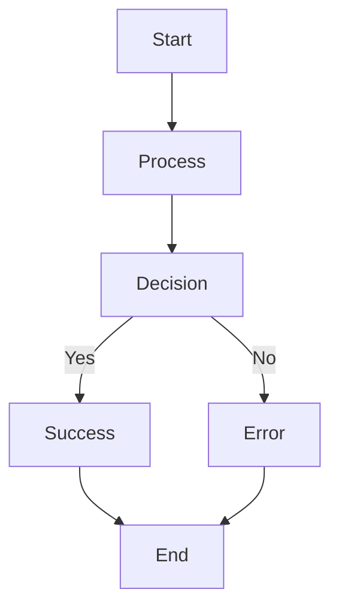
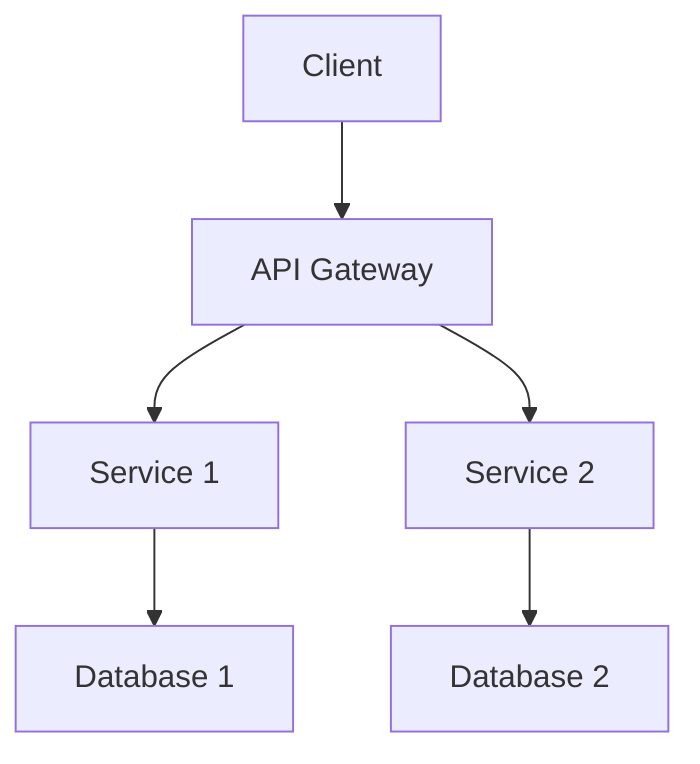

# Template untuk Artikel dengan Interactive Demos

## 📝 **Template Dasar**

Gunakan template ini sebagai starting point untuk artikel dengan interactive demos:

```markdown
---
title: "Judul Artikel yang Menarik"
description: "Deskripsi singkat yang menjelaskan apa yang akan dipelajari pembaca"
date: "YYYY-MM-DD"
tags: ["tag1", "tag2", "tag3"]
category: "Kategori"
author: "Nama Penulis"
readingTime: "X min"
featured: true
interactiveDemos:
  - id: "demo-1"
    type: "code"
    title: "Demo Pertama"
    description: "Penjelasan singkat tentang demo ini"
    icon: "💻"
    featured: true
    metadata:
      difficulty: "beginner"
      duration: "5 min"
      prerequisites: ["basic-knowledge"]
      tags: ["concept1", "concept2"]
  - id: "demo-2"
    type: "visual"
    title: "Demo Visual"
    description: "Demo untuk visualisasi konsep"
    icon: "🎨"
    featured: false
    metadata:
      difficulty: "intermediate"
      duration: "8 min"
      prerequisites: ["basic-knowledge"]
      tags: ["visualization", "diagram"]
  - id: "demo-3"
    type: "interactive"
    title: "Demo Interaktif"
    description: "Demo untuk hands-on learning"
    icon: "🎮"
    featured: true
    metadata:
      difficulty: "intermediate"
      duration: "10 min"
      prerequisites: ["basic-knowledge"]
      tags: ["interactive", "hands-on"]
---

# Judul Artikel yang Menarik

## Pendahuluan

Mulai dengan konteks dan mengapa topik ini penting. Jelaskan apa yang akan dipelajari pembaca.

### Prerequisites

- Pengetahuan dasar yang diperlukan
- Tools atau software yang harus diinstall
- Level pengalaman yang disarankan

### Yang Akan Dipelajari

- Konsep utama yang akan dibahas
- Skill yang akan dikembangkan
- Tools yang akan digunakan

## Konsep Dasar

### Penjelasan Teori

Jelaskan konsep dasar sebelum memberikan demo.

### Demo Pertama

<!-- INTERACTIVE_DEMO:demo-1 -->
```javascript
// Contoh kode yang menjelaskan konsep dasar
const example = {
  property: 'value',
  method: () => {
    console.log('Hello World');
  }
};
```
<!-- END_INTERACTIVE_DEMO -->

**Penjelasan:** Demo ini menunjukkan...

### Demo Visual

<!-- INTERACTIVE_DEMO:demo-2 -->

<!-- END_INTERACTIVE_DEMO -->

**Penjelasan:** Diagram ini menunjukkan...

## Konsep Lanjutan

### Penjelasan Lebih Dalam

Jelaskan konsep yang lebih advanced.

### Demo Interaktif

<!-- INTERACTIVE_DEMO:demo-3 -->
```html
<!-- Interactive Demo -->
<div class="demo-container">
  <input type="text" id="input" placeholder="Enter text">
  <button id="button">Process</button>
  <div id="output"></div>
</div>

<script>
document.getElementById('button').addEventListener('click', () => {
  const input = document.getElementById('input').value;
  const output = document.getElementById('output');
  output.textContent = `Processed: ${input}`;
});
</script>
```
<!-- END_INTERACTIVE_DEMO -->

**Penjelasan:** Demo ini memungkinkan...

## Best Practices

### Tips dan Trik

- Tip 1: Penjelasan singkat
- Tip 2: Penjelasan singkat
- Tip 3: Penjelasan singkat

### Common Pitfalls

- Kesalahan umum 1: Penjelasan dan solusi
- Kesalahan umum 2: Penjelasan dan solusi
- Kesalahan umum 3: Penjelasan dan solusi

## Kesimpulan

### Ringkasan

- Poin utama yang dipelajari
- Skill yang dikembangkan
- Tools yang dikuasai

### Next Steps

- Langkah selanjutnya untuk belajar lebih lanjut
- Resources tambahan
- Proyek yang bisa dicoba

---

*Artikel ini dibuat dengan menggunakan struktur markdown yang mendukung interactive demos untuk memberikan pengalaman belajar yang lebih engaging.*
```

## 🎯 **Template untuk Berbagai Jenis Artikel**

### **1. Tutorial Step-by-Step**

```markdown
---
title: "Tutorial: Membuat [Aplikasi/Fitur] dari Awal"
description: "Panduan lengkap untuk membuat [aplikasi/fitur] dengan contoh praktis"
interactiveDemos:
  - id: "setup"
    type: "code"
    title: "Setup Project"
    description: "Setup awal project dan dependencies"
    icon: "⚙️"
    featured: true
  - id: "basic-structure"
    type: "code"
    title: "Basic Structure"
    description: "Membuat struktur dasar aplikasi"
    icon: "🏗️"
    featured: true
  - id: "implementation"
    type: "interactive"
    title: "Implementation"
    description: "Implementasi fitur utama"
    icon: "🚀"
    featured: true
---

# Tutorial: Membuat [Aplikasi/Fitur] dari Awal

## Step 1: Setup Project

### Demo Setup

<!-- INTERACTIVE_DEMO:setup -->
```bash
# Install dependencies
npm install [package1] [package2]

# Initialize project
npm init -y
```
<!-- END_INTERACTIVE_DEMO -->

## Step 2: Basic Structure

### Demo Structure

<!-- INTERACTIVE_DEMO:basic-structure -->
```javascript
// Basic project structure
const project = {
  name: 'My Project',
  version: '1.0.0',
  dependencies: ['package1', 'package2']
};
```
<!-- END_INTERACTIVE_DEMO -->

## Step 3: Implementation

### Demo Implementation

<!-- INTERACTIVE_DEMO:implementation -->
```javascript
// Interactive implementation
function createApp() {
  // Implementation code
}
```
<!-- END_INTERACTIVE_DEMO -->
```

### **2. Comparison Article**

```markdown
---
title: "Perbandingan: [Tool A] vs [Tool B]"
description: "Analisis mendalam perbandingan antara [Tool A] dan [Tool B]"
interactiveDemos:
  - id: "tool-a-demo"
    type: "code"
    title: "[Tool A] Example"
    description: "Contoh penggunaan Tool A"
    icon: "🔧"
    featured: true
  - id: "tool-b-demo"
    type: "code"
    title: "[Tool B] Example"
    description: "Contoh penggunaan Tool B"
    icon: "⚡"
    featured: true
  - id: "comparison-table"
    type: "visual"
    title: "Comparison Table"
    description: "Tabel perbandingan fitur"
    icon: "📊"
    featured: true
---

# Perbandingan: [Tool A] vs [Tool B]

## Overview

Penjelasan singkat tentang kedua tool dan mengapa perbandingan ini penting.

## Tool A

### Demo Tool A

<!-- INTERACTIVE_DEMO:tool-a-demo -->
```javascript
// Tool A implementation
const toolA = new ToolA({
  config: 'value'
});
```
<!-- END_INTERACTIVE_DEMO -->

## Tool B

### Demo Tool B

<!-- INTERACTIVE_DEMO:tool-b-demo -->
```javascript
// Tool B implementation
const toolB = new ToolB({
  config: 'value'
});
```
<!-- END_INTERACTIVE_DEMO -->

## Comparison

### Comparison Table

<!-- INTERACTIVE_DEMO:comparison-table -->
```markdown
| Feature | Tool A | Tool B |
|---------|--------|--------|
| Feature 1 | ✅ | ❌ |
| Feature 2 | ❌ | ✅ |
| Feature 3 | ✅ | ✅ |
```
<!-- END_INTERACTIVE_DEMO -->
```

### **3. Technical Deep Dive**

```markdown
---
title: "Deep Dive: [Teknologi/Konsep]"
description: "Analisis mendalam tentang [teknologi/konsep] dengan contoh praktis"
interactiveDemos:
  - id: "architecture"
    type: "visual"
    title: "Architecture Diagram"
    description: "Diagram arsitektur sistem"
    icon: "🏛️"
    featured: true
  - id: "implementation"
    type: "code"
    title: "Implementation"
    description: "Implementasi konsep"
    icon: "💻"
    featured: true
  - id: "performance-test"
    type: "interactive"
    title: "Performance Test"
    description: "Test performa dengan tool interaktif"
    icon: "⚡"
    featured: true
---

# Deep Dive: [Teknologi/Konsep]

## Architecture

### Architecture Diagram

<!-- INTERACTIVE_DEMO:architecture -->

<!-- END_INTERACTIVE_DEMO -->

## Implementation

### Demo Implementation

<!-- INTERACTIVE_DEMO:implementation -->
```javascript
// Implementation code
class System {
  constructor() {
    this.initialize();
  }
}
```
<!-- END_INTERACTIVE_DEMO -->

## Performance

### Performance Test

<!-- INTERACTIVE_DEMO:performance-test -->
```javascript
// Performance testing code
function performanceTest() {
  // Test implementation
}
```
<!-- END_INTERACTIVE_DEMO -->
```

## 🎨 **Tips untuk Penulis**

### **1. Struktur Konten**

- ✅ **Mulai dengan konteks** - Mengapa topik ini penting?
- ✅ **Jelaskan prerequisites** - Apa yang perlu diketahui sebelumnya?
- ✅ **Gunakan progressive disclosure** - Dari simple ke complex
- ✅ **Berikan penjelasan** sebelum dan sesudah demo
- ✅ **Sertakan best practices** dan common pitfalls

### **2. Demo Placement**

- ✅ **Place demos** setelah penjelasan konsep
- ✅ **Gunakan featured demos** untuk highlight penting
- ✅ **Berikan context** sebelum setiap demo
- ✅ **Include explanations** setelah demo
- ✅ **Link related demos** untuk continuity

### **3. Metadata Optimization**

```yaml
interactiveDemos:
  - id: "descriptive-id"
    type: "code|visual|interactive"
    title: "Clear, Descriptive Title"
    description: "What this demo does and why it's useful"
    icon: "🎯"  # Relevant emoji
    featured: true  # Highlight important demos
    metadata:
      difficulty: "beginner|intermediate|advanced"
      duration: "X min"
      prerequisites: ["prerequisite1", "prerequisite2"]
      tags: ["tag1", "tag2"]
      relatedDemos: ["other-demo-id"]
```

### **4. Content Quality**

- ✅ **Use clear, descriptive titles** untuk demos
- ✅ **Provide meaningful descriptions** yang menjelaskan value
- ✅ **Choose appropriate icons** yang relevan dengan content
- ✅ **Set correct difficulty levels** untuk target audience
- ✅ **Include relevant tags** untuk discoverability

### **5. Testing dan Validation**

- ✅ **Test semua demos** sebelum publish
- ✅ **Verify syntax highlighting** bekerja dengan benar
- ✅ **Check responsive behavior** di mobile dan desktop
- ✅ **Validate metadata** completeness
- ✅ **Test navigation** antar tab

## 📊 **Analytics dan Optimization**

### **1. Track Demo Performance**

```javascript
// Track demo engagement
function trackDemoEvent(eventType, demoId, metadata) {
  if (typeof window !== 'undefined' && window.gtag) {
    window.gtag('event', eventType, {
      event_category: 'interactive_demo',
      event_label: demoId,
      custom_parameters: metadata
    });
  }
}
```

### **2. Monitor User Behavior**

- ✅ **Demo views** - Berapa kali demo dilihat
- ✅ **Tab switches** - Transisi antar tab
- ✅ **Time spent** - Durasi interaksi
- ✅ **Completion rate** - Persentase demo yang diselesaikan
- ✅ **Error rate** - Tingkat error dalam demo

### **3. Optimize Based on Data**

- ✅ **Identify popular demos** dan buat lebih banyak
- ✅ **Fix demos dengan error rate tinggi**
- ✅ **Improve demos dengan completion rate rendah**
- ✅ **Optimize loading time** untuk demos yang lambat
- ✅ **A/B test** different demo formats

## 🚀 **Best Practices**

### **1. Content Strategy**

- ✅ **Plan demo sequence** sebelum menulis
- ✅ **Use consistent naming** untuk demo IDs
- ✅ **Group related demos** dalam artikel yang sama
- ✅ **Create demo templates** untuk consistency
- ✅ **Document demo patterns** untuk tim

### **2. Technical Implementation**

- ✅ **Use semantic HTML** untuk accessibility
- ✅ **Implement proper ARIA labels** untuk screen readers
- ✅ **Optimize for mobile** dengan responsive design
- ✅ **Use lazy loading** untuk demos yang tidak featured
- ✅ **Implement error handling** untuk demo failures

### **3. User Experience**

- ✅ **Provide clear instructions** untuk setiap demo
- ✅ **Include progress indicators** untuk demos yang panjang
- ✅ **Allow undo/redo** untuk interactive demos
- ✅ **Save user progress** untuk demos yang kompleks
- ✅ **Provide help tooltips** untuk fitur yang tidak jelas

**Template ini memberikan foundation yang solid untuk membuat artikel yang engaging dan interaktif!** 🎉
