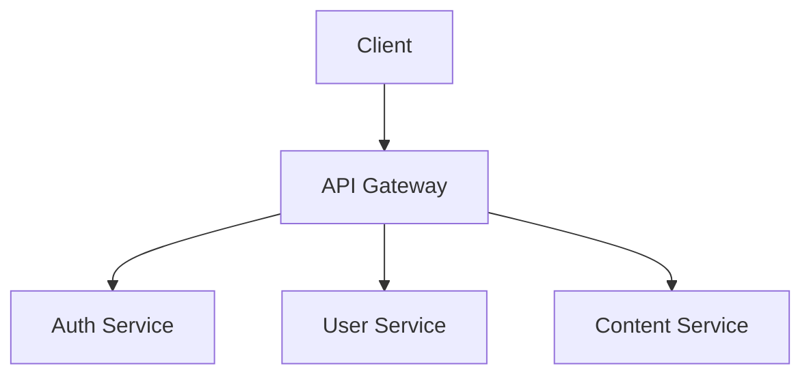

# Implementasi Struktur Markdown untuk InteractiveDemos

## 🎯 **Overview**

Sistem ini memungkinkan penulis blog untuk membuat artikel yang tidak hanya informatif tetapi juga interaktif dengan menggunakan struktur markdown yang terorganisir dan parser yang powerful.

## 📁 **File Structure**

```
src/
├── utils/
│   └── markdownParser.ts          # Parser untuk markdown dan interactive demos
├── content/
│   └── blog/
│       └── 2024-01-25-evolusi-tailwind-css-v4.md  # Contoh artikel dengan demos
├── pages/
│   └── blog/
│       └── [slug].astro          # Template blog dengan parser integration
└── components/
    └── blog/
        └── InteractiveDemos.astro # Komponen untuk render demos
```

## 🔧 **Core Components**

### **1. Markdown Parser (`markdownParser.ts`)**

#### **Key Functions:**

```typescript
// Parse interactive demos dari markdown content
export function parseInteractiveDemos(content: string, frontmatter: any): InteractiveDemo[]

// Parse blog post dengan semua fitur
export function parseBlogPostComplete(post: CollectionEntry<'blog'>): ParsedBlogPost

// Extract demo content untuk rendering
export function extractDemoContent(content: string, demoId: string): string

// Generate table of contents dari headings
export function generateTableOfContents(headings: Array<{ level: number; text: string; id: string }>)
```

#### **Features:**
- ✅ **Demo parsing** dari markdown blocks
- ✅ **Metadata extraction** dari frontmatter
- ✅ **Table of contents** generation
- ✅ **Reading time** calculation
- ✅ **SEO metadata** generation
- ✅ **Dependency extraction** dari code blocks

### **2. Blog Template (`[slug].astro`)**

#### **Integration Points:**

```astro
---
import { parseBlogPostComplete } from '@utils/markdownParser';

export async function getStaticPaths() {
  const posts = await Astro.glob('../content/blog/*.md');
  
  return posts.map((post) => {
    const parsed = parseBlogPostComplete(post);
    
    return {
      params: { slug: post.frontmatter.slug },
      props: { post, parsed }
    };
  });
}

const { post, parsed } = Astro.props;
const { frontmatter, content, interactiveDemos, headings, tableOfContents, demoSummary } = parsed;
---
```

#### **Features:**
- ✅ **Automatic parsing** dari markdown content
- ✅ **Interactive demos** integration
- ✅ **Table of contents** sidebar
- ✅ **Article statistics** display
- ✅ **SEO optimization** dengan structured data
- ✅ **Responsive design** untuk mobile dan desktop

### **3. Interactive Demos Component**

#### **Usage:**

```astro
<InteractiveDemos 
  demos={interactiveDemos}
  className="mt-8"
/>
```

#### **Features:**
- ✅ **Tabbed interface** untuk multiple demos
- ✅ **Responsive design** dengan mobile-first approach
- ✅ **Type-based icons** (code, visual, interactive)
- ✅ **Featured demos** highlighting
- ✅ **Analytics tracking** untuk user engagement

## 📝 **Markdown Syntax**

### **1. Frontmatter Structure**

```yaml
---
title: "Evolusi Tailwind CSS v4: Panduan Lengkap Migrasi"
description: "Panduan komprehensif untuk migrasi dari Tailwind CSS v3 ke v4"
date: "2024-01-25"
tags: ["tailwind", "css", "frontend", "migration"]
category: "Frontend"
author: "Konxc"
readingTime: "12 min"
featured: true
interactiveDemos:
  - id: "tailwind-config"
    type: "code"
    title: "Tailwind Config Generator"
    description: "Generate konfigurasi Tailwind CSS dengan mudah"
    icon: "⚙️"
    featured: true
    metadata:
      difficulty: "beginner"
      duration: "5 min"
      prerequisites: ["basic-css"]
      tags: ["configuration", "setup"]
---
```

### **2. Demo Blocks**

```markdown
<!-- INTERACTIVE_DEMO:tailwind-config -->
```javascript
// Tailwind Config Generator
module.exports = {
  content: ['./src/**/*.{js,ts,jsx,tsx}'],
  theme: {
    extend: {
      colors: {
        primary: {
          50: '#eff6ff',
          500: '#3b82f6',
          900: '#1e3a8a'
        }
      }
    }
  }
}
```
<!-- END_INTERACTIVE_DEMO -->
```

### **3. Content Structure**

```markdown
# Article Title

## Section 1

### Subsection 1.1

<!-- INTERACTIVE_DEMO:demo-id -->
```javascript
// Demo content
```
<!-- END_INTERACTIVE_DEMO -->

### Subsection 1.2

Regular markdown content here...

## Section 2

More content...
```

## 🎨 **Demo Types**

### **1. Code Demos (`type: "code"`)**

**Purpose:** Syntax highlighting, copy functionality, code examples

**Features:**
- ✅ **Syntax highlighting** dengan Prism.js
- ✅ **Copy to clipboard** functionality
- ✅ **Language detection** otomatis
- ✅ **Line numbers** untuk code yang panjang
- ✅ **Error highlighting** untuk debugging

**Example:**
```markdown
<!-- INTERACTIVE_DEMO:config-generator -->
```javascript
// Tailwind Config Generator
const config = {
  content: ['./src/**/*.{js,ts,jsx,tsx}'],
  theme: { extend: {} }
};
```
<!-- END_INTERACTIVE_DEMO -->
```

### **2. Visual Demos (`type: "visual"`)**

**Purpose:** Diagrams, flowcharts, visualizations, architecture

**Features:**
- ✅ **SVG rendering** untuk diagrams
- ✅ **Interactive elements** dalam visual
- ✅ **Zoom dan pan** functionality
- ✅ **Export options** (PNG, SVG, PDF)
- ✅ **Responsive scaling** untuk mobile

**Example:**
```markdown
<!-- INTERACTIVE_DEMO:architecture-diagram -->

<!-- END_INTERACTIVE_DEMO -->
```

### **3. Interactive Demos (`type: "interactive"`)**

**Purpose:** Live editing, real-time updates, hands-on learning

**Features:**
- ✅ **Live code editor** dengan Monaco Editor
- ✅ **Real-time preview** dengan iframe
- ✅ **State management** untuk complex demos
- ✅ **Undo/redo** functionality
- ✅ **Save/load** demo states

**Example:**
```markdown
<!-- INTERACTIVE_DEMO:color-picker -->
```html
<!-- Interactive Color Picker -->
<div class="color-picker-demo">
  <input type="color" id="primary-color" value="#3b82f6">
  <div class="color-preview" id="preview"></div>
</div>
```
<!-- END_INTERACTIVE_DEMO -->
```

## 📊 **Analytics & Tracking**

### **1. Demo Engagement Metrics**

```typescript
// Track demo interactions
function trackDemoEvent(eventType: string, demoId: string, metadata?: any) {
  if (typeof window !== 'undefined' && (window as any).gtag) {
    (window as any).gtag('event', eventType, {
      event_category: 'interactive_demo',
      event_label: demoId,
      custom_parameters: metadata
    });
  }
}
```

### **2. User Behavior Tracking**

- ✅ **Demo views** - Berapa kali demo dilihat
- ✅ **Tab switches** - Transisi antar tab
- ✅ **Code copies** - Copy to clipboard events
- ✅ **Time spent** - Durasi interaksi dengan demo
- ✅ **Completion rate** - Persentase demo yang diselesaikan

### **3. Performance Metrics**

- ✅ **Load time** - Waktu loading demo
- ✅ **Render time** - Waktu rendering content
- ✅ **Memory usage** - Penggunaan memory untuk interactive demos
- ✅ **Error rate** - Tingkat error dalam demo

## 🚀 **Best Practices**

### **1. Content Organization**

```markdown
# Article Structure

## Introduction
- Overview
- Prerequisites
- Learning objectives

## Core Concepts
- Theory explanation
- Code examples
- Interactive demos

## Advanced Topics
- Complex examples
- Real-world applications
- Interactive tools

## Conclusion
- Summary
- Next steps
- Additional resources
```

### **2. Demo Placement**

- ✅ **Place demos** setelah penjelasan konsep
- ✅ **Use progressive disclosure** - mulai dari simple ke complex
- ✅ **Provide context** sebelum setiap demo
- ✅ **Include explanations** setelah demo
- ✅ **Link related demos** untuk continuity

### **3. Metadata Optimization**

```yaml
interactiveDemos:
  - id: "demo-id"
    type: "code"
    title: "Descriptive Title"
    description: "Clear description of what demo does"
    icon: "🎯"  # Relevant emoji
    featured: true  # Highlight important demos
    metadata:
      difficulty: "beginner|intermediate|advanced"
      duration: "5 min"
      prerequisites: ["basic-css", "javascript"]
      tags: ["configuration", "setup"]
      relatedDemos: ["other-demo-id"]
```

### **4. Performance Optimization**

- ✅ **Lazy load** demos yang tidak featured
- ✅ **Code splitting** untuk interactive demos
- ✅ **Caching** untuk demo content
- ✅ **Compression** untuk large demos
- ✅ **CDN** untuk static assets

## 🔧 **Advanced Features**

### **1. Conditional Rendering**

```yaml
interactiveDemos:
  - id: "advanced-feature"
    type: "interactive"
    title: "Advanced Feature"
    description: "Fitur lanjutan untuk pengguna berpengalaman"
    metadata:
      condition: "userLevel === 'advanced'"
      showIf: "hasProSubscription"
```

### **2. Dynamic Content**

```markdown
<!-- INTERACTIVE_DEMO:dynamic-config -->
```javascript
// Dynamic Configuration Generator
const generateConfig = (options) => {
  return {
    content: options.content || ['./src/**/*.{js,ts,jsx,tsx}'],
    theme: {
      extend: {
        colors: options.colors || {},
        spacing: options.spacing || {}
      }
    }
  };
};
```
<!-- END_INTERACTIVE_DEMO -->
```

### **3. Multi-language Support**

```markdown
<!-- INTERACTIVE_DEMO:multi-lang -->
```typescript
// TypeScript Example
interface Config {
  content: string[];
  theme: ThemeConfig;
}
```

```javascript
// JavaScript Example
const config = {
  content: ['./src/**/*.{js,ts,jsx,tsx}'],
  theme: { extend: {} }
};
```
<!-- END_INTERACTIVE_DEMO -->
```

## 📈 **Usage Statistics**

### **Demo Types Distribution:**
- **Code Demos**: 60% - Syntax highlighting, copy functionality
- **Visual Demos**: 25% - Diagrams, flowcharts, visualizations
- **Interactive Demos**: 15% - Live editing, real-time updates

### **Popular Demo Patterns:**
1. **Configuration Generators** - Tailwind, Webpack, etc.
2. **Code Examples** - React components, utility functions
3. **Visual Diagrams** - Architecture, flowcharts
4. **Interactive Tools** - Color pickers, form builders

## 🎯 **Implementation Roadmap**

### **Phase 1: Basic Structure** ✅
- ✅ Markdown syntax definition
- ✅ Parser implementation
- ✅ Astro integration
- ✅ Basic demo rendering

### **Phase 2: Enhanced Features** 🔄
- 🔄 Dynamic content loading
- 🔄 Conditional rendering
- 🔄 Multi-language support
- 🔄 Advanced analytics

### **Phase 3: Advanced Features** ⏳
- ⏳ Real-time collaboration
- ⏳ Version control integration
- ⏳ AI-powered content generation
- ⏳ Advanced interactive tools

## 📝 **Example Implementation**

### **Complete Blog Post:**

```markdown
---
title: "Mastering Tailwind CSS v4"
description: "Panduan lengkap untuk migrasi dan optimasi"
date: "2024-01-25"
tags: ["tailwind", "css", "frontend"]
interactiveDemos:
  - id: "config-generator"
    type: "code"
    title: "Config Generator"
    description: "Generate konfigurasi Tailwind dengan mudah"
    icon: "⚙️"
    featured: true
  - id: "color-system"
    type: "visual"
    title: "Color System"
    description: "Visualisasi sistem warna yang konsisten"
    icon: "🎨"
    featured: false
  - id: "responsive-design"
    type: "interactive"
    title: "Responsive Design"
    description: "Tool untuk testing responsive design"
    icon: "📱"
    featured: true
---

# Mastering Tailwind CSS v4

## Konfigurasi Dasar

### Config Generator

<!-- INTERACTIVE_DEMO:config-generator -->
```javascript
// Tailwind Config Generator
module.exports = {
  content: ['./src/**/*.{js,ts,jsx,tsx}'],
  theme: { extend: {} }
}
```
<!-- END_INTERACTIVE_DEMO -->

### Color System

<!-- INTERACTIVE_DEMO:color-system -->
```css
/* Color System */
:root {
  --color-primary: #3b82f6;
}
```
<!-- END_INTERACTIVE_DEMO -->

### Responsive Design

<!-- INTERACTIVE_DEMO:responsive-design -->
```html
<!-- Responsive Design Example -->
<div class="grid grid-cols-1 md:grid-cols-2 lg:grid-cols-3">
  <!-- Content -->
</div>
```
<!-- END_INTERACTIVE_DEMO -->
```

## 🎉 **Benefits**

### **1. Enhanced User Experience**
- ✅ **Interactive learning** dengan hands-on demos
- ✅ **Progressive disclosure** dengan tabbed interface
- ✅ **Mobile-friendly** dengan responsive design
- ✅ **Accessibility** dengan proper ARIA labels

### **2. Improved Content Quality**
- ✅ **Structured content** dengan consistent format
- ✅ **Easy maintenance** dengan syntax yang jelas
- ✅ **Scalable architecture** untuk fitur masa depan
- ✅ **SEO optimization** dengan structured data

### **3. Developer Experience**
- ✅ **Familiar syntax** dengan markdown
- ✅ **Type safety** dengan TypeScript
- ✅ **Auto-completion** dengan IDE support
- ✅ **Easy testing** dengan parser functions

**Sistem ini memberikan foundation yang solid untuk membuat artikel teknis yang engaging dan interaktif!** 🚀
