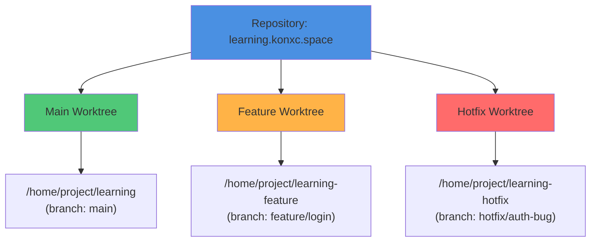

# Git Worktree: Tingkatkan Produktivitas Development Tanpa Mengganggu Workflow

_Solusi praktis untuk developer yang ingin bekerja lebih efisien dengan multiple branch secara parallel tanpa kelelahan mental akibat switching branch berulang-ulang._

---

## Pendahuluan: Masalah yang Sering Kita Hadapi

Sebagai developer di tim Koneksi, pernahkah Anda mengalami situasi seperti ini?

- **Sedang mengerjakan feature A**, tiba-tiba ada urgent bug fix yang harus dikerjakan di branch lain
- **Ingin test build** dari branch berbeda, tapi malas pindah branch karena masih banyak uncommitted changes
- **Ingin review code PR** teman di branch terpisah sambil tetap bekerja di feature sendiri
- **AI assistant** bekerja di branch lain tapi mengganggu working directory Anda

**Solusi tradisional:** `git stash` → `git checkout` → kerja → `git checkout` → `git stash pop`

Proses ini bisa menjadi **cognitive overhead** yang menguras energi mental Anda. Setiap kali harus switch branch, Anda perlu:

1. Mengingat state saat ini (apa yang sedang dikerjakan?)
2. Stash atau commit perubahan yang belum selesai
3. Switch branch dan loading semua file baru
4. Bekerja di context baru
5. Switch kembali dan restore state sebelumnya

**Ada solusi yang lebih baik: Git Worktree.**

## Apa Itu Git Worktree?

Git worktree adalah fitur Git yang memungkinkan Anda memiliki **multiple working directories** dari **satu repository yang sama**, masing-masing bisa checkout ke branch berbeda **secara bersamaan**.

### Analogi Sederhana

Bayangkan Anda punya satu buku (repository) yang bisa dibuka di beberapa halaman berbeda (branch) secara bersamaan di meja yang berbeda (working directory). Tidak perlu bookmark atau hafalin halaman - semua terbuka dan bisa dilihat kapan saja!

### Conceptual Overview



## Perbedaan dengan Git Checkout/Branch

### Dengan Git Checkout (Cara Tradisional)

```bash
# Working directory utama
git checkout main        # Semua file berubah ke main
# Bekerja di main...

git checkout feature     # Semua file berubah lagi ke feature
# Bekerja di feature...

git checkout main        # Kembali lagi, kehilangan context
```

**Masalahnya:**

- Satu working directory untuk semua branch
- Harus switch branch setiap kali mau kerja di branch lain
- Uncommitted changes jadi penghalang
- Context switching = mental fatigue
- Tidak bisa lihat perbandingan secara langsung

### Dengan Git Worktree (Solusi Modern)

```bash
# Main worktree - tetap di branch main
/home/project/learning/          # Working directory 1 (branch: main)

# Feature worktree - checkout ke branch feature
/home/project/learning-feature/  # Working directory 2 (branch: feature)

# Hotfix worktree - checkout ke branch hotfix
/home/project/learning-hotfix/   # Working directory 3 (branch: hotfix)
```

**Keuntungannya:**

- Multiple working directories, masing-masing dengan branch sendiri
- Tidak perlu switch - semuanya tersedia parallel
- Uncommitted changes di satu worktree tidak mengganggu lainnya
- Bisa compare secara visual antara branch
- Tidak ada context loss - semua tersedia bersamaan

<!-- INTERACTIVE_DEMO:worktree-vs-checkout -->

```visual
# Comparison: Git Checkout vs Git Worktree

## Scenario: Work on 3 features simultaneously

### Traditional Way (git checkout)
Time spent:
- Stash changes: 5 seconds
- Checkout branch: 10 seconds
- Context reload: 30 seconds
- Work on feature: varies
- Checkout back: 10 seconds
- Stash pop: 5 seconds
Total overhead per switch: ~60 seconds

If switch 10 times/day: 10 minutes lost

### Worktree Way
Setup once:
- Create worktree: 2 seconds
- Done. All branches available simultaneously.

Zero switching overhead. Just open different folders.
```

<!-- END_INTERACTIVE_DEMO -->

## Cara Menggunakan Git Worktree

### 1. Membuat Worktree Baru untuk Branch Baru

```bash
# Membuat branch baru dan worktree baru sekaligus
git worktree add ../learning-feature -b feature/new-login
```

Ini akan:

- Membuat branch baru `feature/new-login`
- Membuat folder `../learning-feature`
- Checkout branch tersebut di folder baru
- Semua operasi Git bekerja normal di folder baru

### 2. Membuat Worktree untuk Branch yang Sudah Ada

```bash
# Worktree untuk branch yang sudah ada
git worktree add ../learning-hotfix hotfix/critical-bug
```

### 3. Melihat Daftar Worktree Aktif

```bash
git worktree list
```

**Output contoh:**

```
/home/dev/web/koneksi/learning.konxc.space      abc123 [main]
/home/dev/web/koneksi/learning-feature          def456 [feature/login]
/home/dev/web/koneksi/learning-hotfix           ghi789 [hotfix/critical]
```

### 4. Menghapus Worktree (Clean Up)

```bash
# Setelah selesai bekerja dan branch sudah di-merge
git worktree remove ../learning-feature

# Atau jika folder sudah dihapus secara manual
git worktree prune
```

### 5. Pindah ke Worktree Lain

Tidak ada perintah khusus! Cukup `cd` ke folder worktree yang diinginkan:

```bash
cd ../learning-feature
# Sekarang Anda bekerja di worktree tersebut
# Git commands bekerja normal
```

<!-- INTERACTIVE_DEMO:worktree-commands -->

```bash
# ============================================
# Git Worktree Commands Cheat Sheet
# ============================================

# 1. CREATE WORKTREE
# Create new branch + worktree
git worktree add <path> -b <branch-name>

# Create worktree from existing branch
git worktree add <path> <existing-branch>

# Example:
git worktree add ../learning-feature -b feature/new-login
git worktree add ../learning-hotfix hotfix/critical-bug


# 2. LIST WORKTREES
# Show all active worktrees
git worktree list

# Show detailed info
git worktree list --porcelain


# 3. REMOVE WORKTREE
# Remove worktree (safely)
git worktree remove <path>

# Force remove
git worktree remove --force <path>

# Clean up deleted worktrees
git worktree prune


# 4. MOVE WORKTREE
# Move worktree to new location
git worktree move <path> <new-path>


# 5. LOCK/UNLOCK WORKTREE
# Lock worktree (useful for network drives)
git worktree lock <path>

# Unlock worktree
git worktree unlock <path>


# 6. BEST PRACTICES
# Check which worktrees use which branches
git worktree list | grep main

# Find worktree by branch name
git worktree list | grep feature/login
```

<!-- END_INTERACTIVE_DEMO -->

## Use Cases Praktis untuk Tim Koneksi

### Use Case 1: Parallel Feature Development

**Scenario:** Anda sedang develop feature A, tapi perlu fix urgent di feature B.

```bash
# Tetap kerja di main untuk feature A
/home/koneksi/learning/        # feature A (uncommitted changes, in progress)

# Buat worktree untuk feature B tanpa mengganggu
git worktree add ../learning-hotfix -b hotfix/auth-bug

# Sekarang bisa kerja di keduanya tanpa gangguan!
cd ../learning-hotfix
# Fix bug di sini
# Commit dan push dari worktree ini

# Kembali ke main worktree
cd /home/koneksi/learning
# Lanjutkan feature A seperti biasa
```

**Keuntungan:**

- ✅ Tidak perlu stash/unstash
- ✅ Tidak perlu commit setengah jadi
- ✅ Context switching zero overhead
- ✅ Bisa test keduanya secara parallel

### Use Case 2: Testing & Comparison

**Scenario:** Ingin compare behavior antara branch `main` dan `staging` sebelum deploy.

```bash
# Main worktree untuk testing main
git worktree add ../learning-main main

# Staging worktree untuk testing staging
git worktree add ../learning-staging staging

# Run tests di keduanya secara parallel
cd ../learning-main && pnpm test    # Test main
cd ../learning-staging && pnpm test # Test staging

# Compare output secara langsung
diff ../learning-main/test-results.json ../learning-staging/test-results.json
```

**Use Case Real:** Test production build vs development build secara bersamaan.

### Use Case 3: Code Review Lokal

**Scenario:** Review PR dari teman tim sambil tetap kerja di feature sendiri.

```bash
# Worktree untuk review PR #123
git worktree add ../learning-review pr/123-fix-bug

# Fetch branch dari remote
cd ../learning-review
git fetch origin pull/123/head:pr/123-fix-bug
git checkout pr/123-fix-bug

# Review code, test, comment
# Edit file untuk test fix
# Run tests

# Kembali ke worktree utama
cd /home/koneksi/learning
# Tetap bisa kerja normal di feature sendiri
```

**Keuntungan:**

- ✅ Review tidak mengganggu work aktif
- ✅ Bisa test perubahan tanpa risk
- ✅ Bisa edit/experiment tanpa worry

### Use Case 4: AI Assistant Work Isolation

**Scenario:** AI assistant (seperti Cursor Agent) perlu kerja di branch lain tanpa mengganggu workspace Anda.

```bash
# AI bekerja di worktree terpisah
git worktree add ../learning-agent -b agent/feature-refactor

# AI bisa commit, test, dll di worktree terpisah
# Setelah selesai, merge via GitHub/GitLab
# Remove worktree setelah merge
git worktree remove ../learning-agent
```

**Ini adalah cara yang digunakan oleh Cursor ketika "chat agent location" di-set ke worktree!**

## Best Practices untuk Tim Koneksi

### ✅ DO's

#### 1. **Beri nama worktree yang jelas dan deskriptif**

```bash
# ✅ GOOD: Nama jelas dan deskriptif
git worktree add ../learning-login-feature -b feature/login
git worktree add ../learning-hotfix-auth -b hotfix/auth-bug

# ❌ BAD: Nama tidak jelas
git worktree add ../temp1 -b temp
git worktree add ../x -b y
```

#### 2. **Clean up worktree setelah selesai**

```bash
# Setelah PR merged dan branch deleted
git worktree remove ../learning-feature
# Jangan biarkan worktree menumpuk seperti tab browser yang tidak ditutup!
```

#### 3. **Gunakan untuk development active, bukan archive**

- ✅ Worktree untuk active development
- ✅ Worktree untuk testing/comparison temporary
- ❌ Jangan gunakan untuk archival (gunakan branch saja)

#### 4. **Sync dengan remote secara teratur**

```bash
# Di setiap worktree, pull terbaru
cd ../learning-feature && git pull origin feature/xyz

# Atau fetch semua branches di main worktree
cd /home/koneksi/learning
git fetch --all
```

#### 5. **Organize worktree locations konsisten**

```bash
# Buat pattern konsisten untuk tim
../<project>-<type>-<name>

# Examples:
../learning-feature-login      # Feature worktree
../learning-hotfix-auth        # Hotfix worktree
../learning-review-pr123       # Review worktree
../learning-test-staging       # Test worktree
```

### ❌ DON'Ts

#### 1. **Jangan commit dengan pesan "WIP" di worktree**

```bash
# ❌ BAD: Temporary commit di worktree
git commit -m "WIP: working on it"

# ✅ GOOD: Commit dengan pesan meaningful
git commit -m "feat: add login validation"
```

Worktree bukan tempat untuk temporary commit. Commit dengan pesan yang meaningful.

#### 2. **Jangan biarkan worktree tidak terpakai**

```bash
# Check worktree yang tidak aktif
git worktree list

# Clean up worktree yang sudah tidak dipakai
git worktree remove ../learning-feature
# atau
git worktree prune  # Clean up deleted worktrees
```

#### 3. **Jangan delete branch yang sedang digunakan worktree lain**

```bash
# ❌ BAD: Delete branch yang masih digunakan worktree
git branch -d feature/xyz  # ERROR: branch masih digunakan

# ✅ GOOD: Check dulu sebelum delete
git worktree list           # Lihat worktrees aktif
git worktree remove ../learning-feature  # Remove worktree dulu
git branch -d feature/xyz   # Baru delete branch
```

#### 4. **Jangan buat worktree di dalam repository**

```bash
# ❌ BAD: Worktree di dalam repo
git worktree add ./feature  # Inside repository

# ✅ GOOD: Worktree di luar repo atau parent directory
git worktree add ../learning-feature
```

#### 5. **Jangan lupa bahwa worktree share `.git`**

Semua worktree menggunakan `.git` yang sama. Perubahan commit di satu worktree langsung terlihat di worktree lain setelah commit (sebelum push). Ini adalah feature, bukan bug!

## Keuntungan untuk Produktivitas Tim

### 🚀 Efisiensi Waktu

**Before (Traditional):**

```
Stash changes → Checkout branch → Load context → Work →
Checkout back → Stash pop → Load context again
≈ 2-3 minutes overhead per switch
```

**After (Worktree):**

```
Open folder → Work immediately
≈ 0 seconds overhead
```

**Impact:** Jika switch branch 5 kali sehari, save **10-15 menit per hari = 2-3 jam per bulan!**

### 🧠 Mengurangi Cognitive Load

**Masalah traditional approach:**

- Harus ingat "apa yang sedang dikerjakan di branch ini?"
- Context loss saat switch
- Mental stack management (stash/unstash)
- Anxiety akan kehilangan work

**Solusi worktree:**

- Semua context tersedia secara visual (folder terpisah)
- Tidak perlu mental stack management
- Less mental fatigue dari switching berulang
- Peace of mind - semua tersedia

### 👥 Kolaborasi yang Lebih Baik

1. **Review PR lokal lebih mudah**
   - Bisa review tanpa mengganggu work aktif
   - Bisa test perubahan tanpa risk ke main worktree

2. **Testing parallel tidak mengganggu**
   - Test multiple branches secara bersamaan
   - Compare hasil secara langsung

3. **AI tools bisa kerja terisolasi**
   - Agent bisa kerja di worktree terpisah
   - Tidak mengganggu workspace developer

### 📊 Standar Prosedur yang Jelas dan Profesional

Dengan worktree, tim bisa memiliki **standard operating procedure** yang jelas:

1. **Feature development**: Kerja di worktree `../learning-feature-<name>`
2. **Hotfix**: Kerja di worktree `../learning-hotfix-<name>`
3. **Code review**: Kerja di worktree `../learning-review-pr<num>`
4. **Testing**: Kerja di worktree `../learning-test-<env>`

Ini membuat workflow lebih **predictable, maintainable, dan scalable** untuk tim yang berkembang.

## FAQ (Frequently Asked Questions)

### Q: Apakah worktree untuk kolaborasi tim seperti Budi dan Tono?

**A:** Tidak. Worktree adalah tool **lokal** untuk **satu developer**. Kolaborasi antar tim sudah ditangani Git (clone, push, pull, branch, pull request). Worktree membantu developer individual bekerja lebih efisien di komputer mereka sendiri.

**Budi dan Tono tetap berkolaborasi seperti biasa:**

- Clone repository yang sama
- Push/pull via remote (GitHub/GitLab)
- Merge via Pull Request
- **Tidak perlu** worktree untuk kolaborasi

**Worktree hanya untuk:** Work parallel di multiple branch di komputer lokal sendiri.

### Q: Apakah worktree mengubah cara push/pull?

**A:** Tidak. Worktree tetap menggunakan repository Git yang sama. Push/pull bekerja normal seperti biasa. Perbedaan hanya: Anda bisa punya multiple working directories yang masing-masing bisa checkout ke branch berbeda.

### Q: Berapa banyak worktree yang bisa dibuat?

**A:** Secara default Git membatasi 1 main worktree + beberapa secondary worktree. Batasan praktisnya adalah **kebutuhan dan kemampuan manajemen folder**.

**Rekomendasi:** Maksimal 3-5 worktree aktif untuk menghindari kebingungan.

### Q: Bagaimana jika ada conflict?

**A:** Conflict hanya terjadi saat **merge**, bukan karena worktree. Worktree hanya membuat working directory terpisah, tidak membuat branch atau perubahan otomatis.

Jika Anda edit file yang sama di dua worktree, itu akan menjadi conflict saat merge (seperti biasa), bukan karena worktree itu sendiri.

### Q: Apakah worktree aman untuk production?

**A:** Ya, sama amannya dengan git checkout biasa. Worktree hanya membuat working directory baru, tidak mengubah cara Git bekerja. Semua safety features Git tetap berlaku.

### Q: Bagaimana jika saya delete worktree folder secara manual?

**A:** Gunakan `git worktree prune` untuk clean up. Git akan mendeteksi worktree yang sudah tidak ada dan menghapus referensinya.

### Q: Bisa kah worktree digunakan dengan IDE seperti VS Code atau Cursor?

**A:** Ya! IDE modern mendukung worktree dengan baik. Cukup buka folder worktree sebagai workspace terpisah. Beberapa IDE bahkan bisa buka multiple worktree dalam satu window.

## Workflow Rekomendasi untuk Tim Koneksi

Berikut adalah workflow yang direkomendasikan untuk tim Koneksi:

### 📋 Standard Operating Procedure

1. **Feature Development**

   ```bash
   # Create feature worktree
   git worktree add ../learning-feature-<name> -b feature/<name>
   cd ../learning-feature-<name>

   # Develop, test, commit
   # After PR merged: git worktree remove ../learning-feature-<name>
   ```

2. **Hotfix Development**

   ```bash
   # Create hotfix worktree
   git worktree add ../learning-hotfix-<name> -b hotfix/<name>
   cd ../learning-hotfix-<name>

   # Fix, test, commit, deploy
   # After merged: git worktree remove ../learning-hotfix-<name>
   ```

3. **Code Review**

   ```bash
   # Create review worktree
   git worktree add ../learning-review-pr<num> -b review/pr<num>
   cd ../learning-review-pr<num>
   git fetch origin pull/<num>/head:review/pr<num>
   git checkout review/pr<num>

   # Review, test, comment
   # After done: git worktree remove ../learning-review-pr<num>
   ```

4. **Weekly Cleanup**

   ```bash
   # Check active worktrees
   git worktree list

   # Remove completed worktrees
   git worktree remove ../learning-feature-<completed>

   # Prune deleted worktrees
   git worktree prune
   ```

## Kesimpulan

Git worktree adalah **power tool** yang sering terabaikan tapi bisa meningkatkan produktivitas development secara signifikan. Dengan worktree, tim Koneksi bisa:

- ✅ Bekerja di multiple branch secara parallel tanpa gangguan
- ✅ Mengurangi cognitive overhead dari branch switching
- ✅ Membuat workflow yang lebih efisien dan profesional
- ✅ Tetap mempertahankan standar prosedur yang jelas tanpa kelelahan mental

**Key Takeaways:**

1. **Worktree = Multiple working directories**, bukan untuk kolaborasi remote
2. **Setup sekali, gunakan berkali-kali** - overhead minimal
3. **Standardize naming** - buat pattern konsisten untuk tim
4. **Clean up secara teratur** - jangan biarkan worktree menumpuk
5. **Use untuk active work** - bukan untuk archival

**Mulai gunakan hari ini** untuk merasakan perbedaannya!

```bash
# Quick start commands
git worktree list                    # Lihat worktree aktif
git worktree add ../test-feature -b feature/test  # Buat worktree baru
cd ../test-feature                   # Bekerja di worktree baru
```

---

## Next Steps

1. **Coba worktree di project Anda hari ini** - mulai dengan feature kecil
2. **Setup naming convention** untuk tim - diskusikan dengan tim
3. **Document workflow** - tambahkan ke dokumentasi tim
4. **Share pengalaman** - diskusikan use case yang ditemukan

## Sumber Daya Tambahan

- [Git Worktree Documentation](https://git-scm.com/docs/git-worktree)
- [Git Worktree Tutorial (Atlassian)](https://www.atlassian.com/git/tutorials/git-worktree)
- [Pro Git Book: Git Worktree](https://git-scm.com/book/en/v2/Git-Tools-Multiple-Working-Trees)

---

**Ditulis oleh:** Tim Development Koneksi  
**Tags:** Git, Development Tools, Productivity, Best Practices, Workflow  
**Category:** Tutorial

_Mari tingkatkan produktivitas development bersama-sama dengan tools dan practices yang lebih baik. Untuk diskusi lebih lanjut tentang Git workflows atau best practices, hubungi tim di developers@konxc.space._
